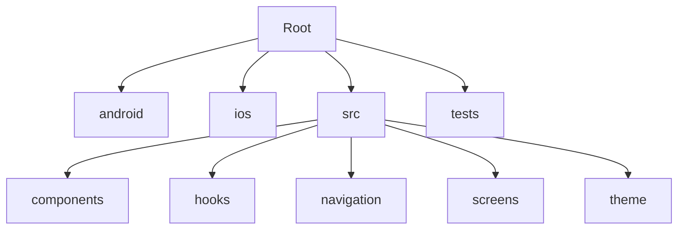

# Heath Life Mobile App
This repository contains the source code for the Heath Life mobile application, which is designed to help users manage their meals, track their health, and provide personalized meal recommendations.

## Features
- Meal Auto Tracking based on AI recognition of food items.
- Remainders for meal times.
- Data visualization for health tracking.

## Project Overview

Heath Life Mobile App is a cross-platform React Native application. It uses a modular architecture, separating business logic, UI components, navigation, and theming. The app leverages hooks for state management, React Navigation for routing, and a custom theme system for consistent styling.

### How it works

- **Startup:** The app initializes and loads user preferences, language, and theme.
- **Navigation:** Uses a stack navigator to switch between screens like Startup and Example.
- **State Management:** Uses React hooks and [TanStack Query](https://tanstack.com/query/latest) for data fetching and caching.
- **Theming:** Custom theme provider supplies colors, fonts, and layout styles throughout the app.
- **Assets:** SVGs and images are loaded dynamically based on the current theme variant.

## Project Structure
```
.
├── android/           # Android native project files
├── ios/               # iOS native project files
├── src/               # Main source code (React Native)
│   ├── components/    # Reusable UI components (atoms, molecules, templates)
│   ├── hooks/         # Custom React hooks (domain logic, language, etc.)
│   ├── navigation/    # Navigation setup and route definitions
│   ├── screens/       # App screens (Example, Startup, etc.)
│   ├── theme/         # Theming system (colors, fonts, gutters, provider)
│   └── ...            # Other utilities and modules
├── tests/             # Unit and integration tests
├── index.js           # App entry point
├── app.json           # App configuration
├── package.json       # Dependencies and scripts
└── ...                # Config files (.env, .gitignore, etc.)
```

## Folder Diagram



## Compile modules and fix issues
To compile the modules and fix any issues, use the following command:
```bash
npx npm-check-updates -u
```

Install the updated packages:
```bash
yarn install
```

If you need to remove the `node_modules` directory and reinstall:
```bash
rm -rf node_modules yarn.lock
```

## UI/UX Design
The UI/UX design is based on modern mobile app design principles, focusing on usability and accessibility. The app features a clean layout with intuitive navigation, ensuring users can easily access meal tracking and health management features.

### React Bits
I'll be using React bits to enhance the app's functionality, link to [React Bits](https://www.reactbits.dev} for more information.


